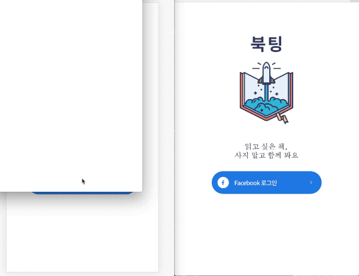

# [Bookting](https://bookting.yerinsite.com)

## Introduction

**Bookting**는 사용자가 자신이 소유한 책을 채팅을 통해 서로 공유하여 보고 싶은 책을 빌려볼 수 있는 웹 어플리케이션입니다.




## Content

- [Installation](#Installation)
- [Features](#Features)
- [Skills](#Skills)
- [Test](#Test)
- [Deployment & Continuous Integration](#Deployment-&-Continuous-Integration)
- [Version Control](#Version-Control)
- [Challenges](#Challenges)
- [Things To Do](#Things-To-Do)
- [Sincere Thanks](#Sincere-Thanks)


## Installation

### Client

```javascript
git clone https://github.com/yerinkim-fe/bookting-frontend
cd bookting-frontend
npm install
npm run dev
```

#### Environment Variables

- 프로젝트 루트에 `.env.local` 파일 생성
- NAME = VALUE 형식으로 아래 변수 추가

```
REACT_APP_FIREBASE_APIKEY
REACT_APP_FIREBASE_AUTH_DOMAIN
```

### Server

```javascript
git clone https://github.com/yerinkim-fe/bookting-backend
cd bookting-backend
npm install
npm run dev
```

#### Environment Variables

- 환경변수 관리 [dotenv](https://github.com/motdotla/dotenv)
- 프로젝트 루트에 `.env` 파일 생성
- NAME = VALUE 형식으로 아래 변수 추가

```
DATABASE_URL
YOUR_SECRET_KEY
COOKIE_SECRET
GITHUB_CLIENT_ID
GITHUB_CLIENT_SECRET
GITHUB_CALLBACK_URL
KAKAO_RESTKEY
```


## Features

- Firebase Social Login (Facebook)
- JSON Web Token을 이용한 사용자 인증 및 로그인 유지
- KAKAO BOOKS API를 이용한 책 검색
- 책 등록 및 삭제 기능
- 무한 스크롤링 구현
- Socket.io를 이용한 책주인과의 실시간 채팅 구현


## Skills

### Client-Side

- ES2015+
- React Component 기반 UI 설계
- React Router 기반 SPA Routing 관리
- Redux를 활용한 state 관리
- Axios
- Socket.io Client
- Firebase Authentication
- Sass(Variables, Nesting, Modules, Extend/Inheritance)

### Server-Side

- 자바스크립트 서버 플랫폼 Nodejs
- ES2015+
- Express를 이용한 RESTful API 설계
- JSON Web Token Authentication
- MongoDB 기반 NoSQL Database 설계
- ODM 라이브러리 Mongoose
- Socket.io


## Test

- Jest, Enzyme을 이용하여 Component Unit Test 구현
- Jest를 이용하여 Reducer Test 구현


## Deployment & Continuous Integration

### Client

- Netlify CI를 통한 배포 자동화

### Server

- AWS Elastic beanstalk를 통한 서비스 배포
- CircleCI를 통한 배포 자동화


## Version Control

- Client, Server의 독립적인 관리를 위한 GIT Repo 구분
- Trello를 이용한 Task Management


## Challenges

- 초반에 스키마 설계를 제대로 하지 못해 중간에 다시 작업하는 일이 있었습니다. 스키마 설계의 중요성을 깨닫는 계기가 되었습니다.
- 첫 프로젝트여서 그런지 예상했던 시간보다 더 많은 시간이 소요되었습니다. 각 기능별 task 설정과 시간 관리를 경험해 볼 수 있었습니다.
- 재사용성 향상을 위해 리팩토링 과정에서 책의 항목을 공통 컴포넌트로 만들었습니다.
- 채팅 메세지가 현재는 서버에 전송된 후 화면에 렌더링되어서 속도가 늦은 단점이 있습니다. 메세지가 전송되면 렌더링이 되게 하고, 렌더링과 별도로 서버에 저장하는 구조로 변경할 예정입니다. 또한, development 환경에서는 메세지 전송시 실시간으로 전송이 되어 화면에 렌더링이 되는데, production 환경에서는 새로고침해야 메시지가 업데이트 되는 버그가 있어 수정할 예정입니다.
- 리덕스를 통한 state 관리, 서버 작업시 비동기 처리 및 몽고디비 명령어 사용 등 Javascript와 React, 몽고디비에 대한 이해가 더 필요하다고 생각했습니다.


## Things To Do

- production 환경에서의 실시간 채팅 버그 및 채팅 속도 개선
- 검색 자동완성
- 댓글 기능
- 현재 위치 기반 검색 기능 (대면 거래)
- 사용자가 위시리스트에 담은 책 목록을 채팅창의 상단에 노출시켜 빌리고 싶은 책 목록 알려주기


## Sincere Thanks

[Ken Huh](https://github.com/Ken123777) / Vanilla Coding
